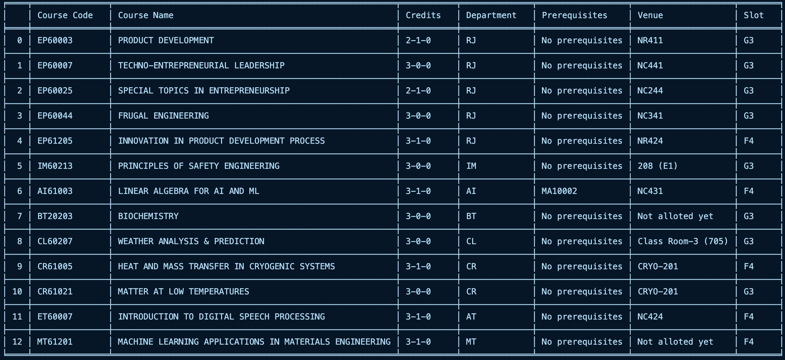

A simple script to find the electives available for you, given your elective slots

---

## Usage 
- This script uses the [iit-kgp-erp-login](https://pypi.org/project/iitkgp-erp-login/) library created by [proffapt](https://github.com/proffapt), and as such, there is some pre-requisite setup to be done 
    - Create the `erpcreds.py` file following the instructions [here](https://pypi.org/project/iitkgp-erp-login/#erpcreds)
    - Generate `token.json` file following the instructions [here](https://pypi.org/project/iitkgp-erp-login/#token) - this can be skipped if you want to enter OTP manually instead
- Install dependencies by running 
```sh
pip install -r requirements.txt
```
- Run the main script following the format: 
```sh
python3 main.py --slots <list-of-slots>
```
- Optional flags:
  - `-o` or `--overwrite`: Overwrite the old `electives.csv` file
  - `--notp`: Don't use the `token.json` file to login, instead enter OTP manually (easier setup)
  
- This will generate a file called `electives.csv` with all the electives, along with `available-electives.txt`, which will list the electives available to you (based on your slots)


## Example
```py
python3 main.py --slots F4 G3
```
- `available-electives.txt`:


#
### Future plans
- Make it a web app for ease of use
****
