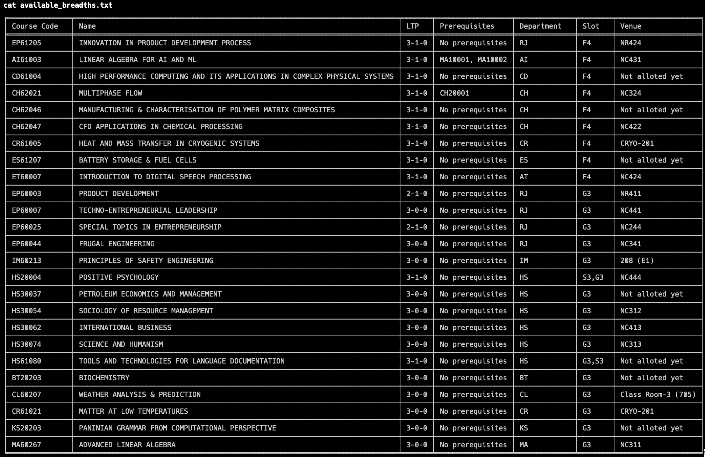
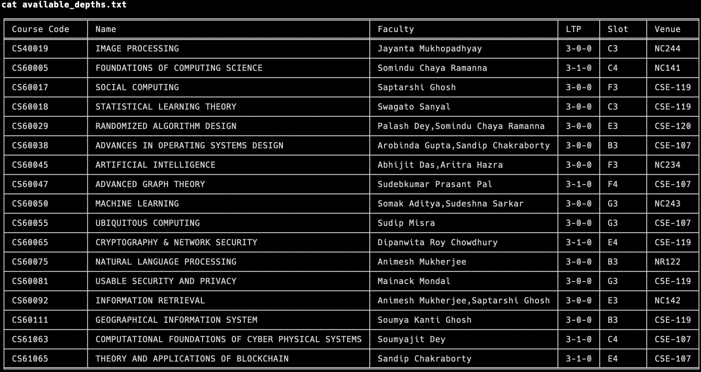

A simple script to find the depth and breadth electives available for you

---

## Setup 
- This script uses the [iit-kgp-erp-login](https://pypi.org/project/iitkgp-erp-login/) library created by [proffapt](https://github.com/proffapt), and as such, there is some pre-requisite setup to be done 
    - Create the `erpcreds.py` file following the instructions [here](https://pypi.org/project/iitkgp-erp-login/#erpcreds)
    - Generate `token.json` file following the instructions [here](https://pypi.org/project/iitkgp-erp-login/#token) - this can be skipped if you want to enter OTP manually instead
- Install dependencies by running 
```sh
pip install -r requirements.txt
```
## Usage

### 1. For breadth electives
- First find the slots available for your elective:
  - Go to Academic -> Time Table -> Central TimeTable 2023-2024 AUTUMN (year and session could vary)
  - Go to the "COMMON SUBJECTS AND BREADTH SLOTS" section corresponding to your year, locate your department, and find the slots where `B` or `HSS` is mentioned
<br>
- Run the `find_breadths.py` script following the format: 
```sh
python3 find_breadths.py --slots <list-of-slots>
```
- Optional flag(s):
  - `-o` or `--overwrite`: Overwrite the old `breadth_electives.csv` file
  - `--notp`: Don't use the `token.json` file to login, instead enter OTP manually (easier setup)
<br>
- This will generate a file called `breadth_electives.csv` with all the breadth electives, along with `available_breadths.txt`, which will list the breadth electives available to you (based on your slots)


#### Example(s)
```sh
python3 find_breadths.py --slots F4 G3 
# find breadth electives for slots F4 and G3 from pre-existing breadth_electives.csv file

python3 find_breadths.py -o --slots F4 G3 
# generate a new breadth_electives.csv with automatic OTP fetching for login and find breadth electives for slots F4 and G3 

python3 find_breadths.py -o --notp --slots F4 G3 
# generate a new breadth_electives.csv with manual OTP input for login and find breadth electives for slots F4 and G3 

```
- Example `available-breadths.txt`:


---

### 2. For depth electives
- Run the `find_depths.py` script following the format: 
```sh
python3 find_depths.py --dept <department-code> --year <year-of-study> --session <session> --semester <semester>
```
- `--dept` is the 2-letter code of your department, eg: `CS`
- `--year` is your year of study, eg: `3
- `session` is in the format `YYYY-YYY`, eg: `2023-2024`
- `semester` is either `AUTUMN` or `SPRING` 
- Optional flag(s):
  - `--notp`: Don't use the `token.json` file to login, instead enter OTP manually (easier setup)

#### Example(s) 
```sh
python3 find_depths.py --dept CS --year 3 --session 2023-2024 --semester AUTUMN
# find depth electives for CS 3rd year, Autumn 2023-2024, with automatic OTP fetching for login

python3 find_depths.py --notp --dept CS --year 3 --session 2023-2024 --semester AUTUMN
# find depth electives for CS 3rd year, Autumn 2023-2024, with manual OTP input for login
```

- Example `available-depths.txt`:


--- 

### Future plans
- Make it a web app for ease of use

